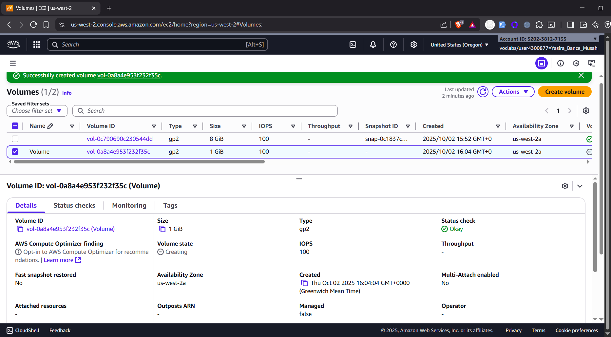
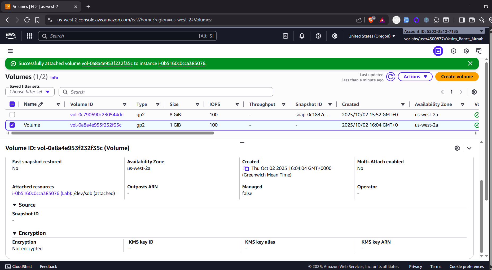
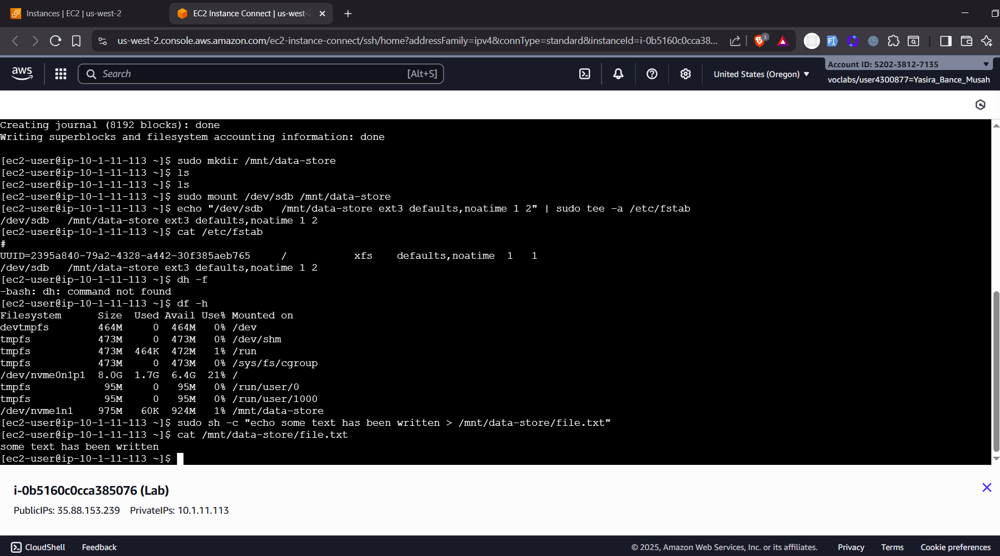
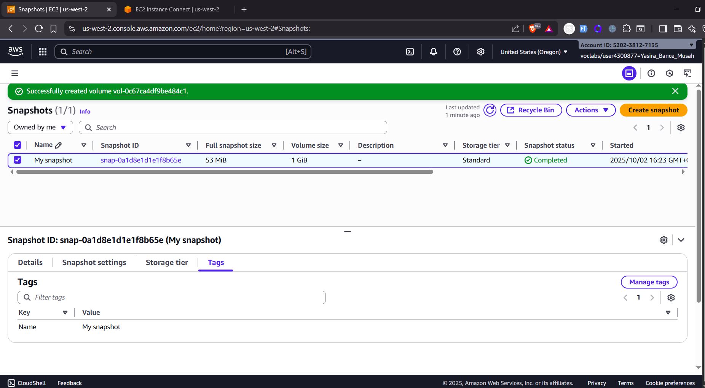
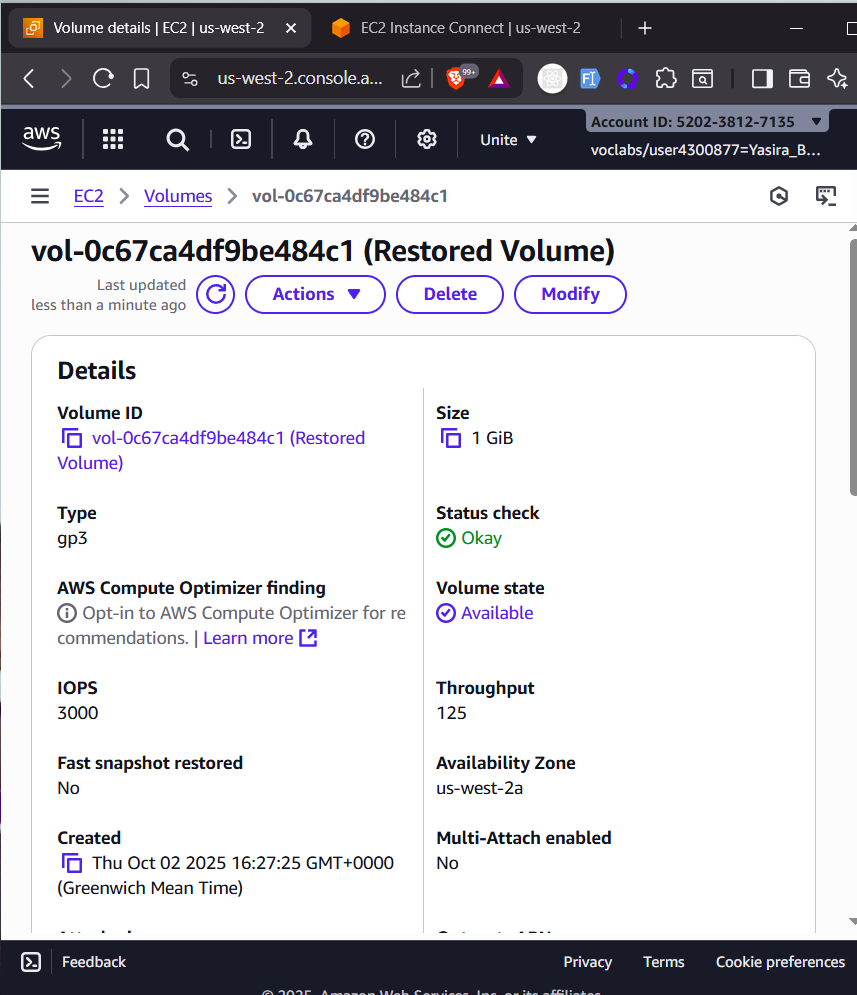
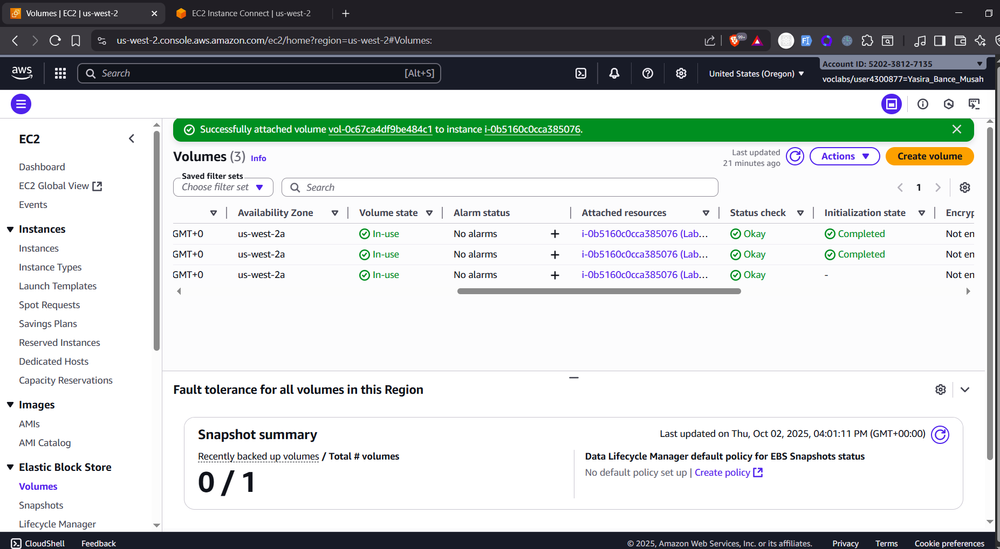

# Working with Amazon EBS


## Lab Overview

Amazon Elastic Block Store (Amazon EBS) is a scalable, high-performance block-storage service designed for Amazon EC2.

## 🎯 Objectives:

- Create an EBS volume.
- Attach and mount an EBS volume to an EC2 instance.
- Create a snapshot of an EBS volume.
- Create an EBS volume from a snapshot.

---

## Task 1: Creating a New EBS Volume

1. Opened the **EC2 Management Console**.
2. Located the **Lab instance**. Noted its **Availability Zone** (e.g., `us-west-2a`).
3. Navigated to **Elastic Block Store → Volumes**.
4. Selected **Create Volume** and configured the following:
   - Type: `gp2`
   - Size: `1 GiB`
   - Availability Zone: Same as Lab instance
   - Tag: `Name=Volume`
5. Verify the volume appears with state `Available`.

📸 _Screenshot: Volume created_


---

## Task 2: Attaching the Volume

1. Selected **Volume → Actions → Attach volume**.
2. Attached to **Lab instance** with device name set to `/dev/sdb`.
3. Verified the status changed to **In-use**.

📸 _Screenshot: Volume attached_



---

## Task 3: Connecting to EC2 Instance

1. Used **EC2 Instance Connect → Connect**.
2. Verify access via the terminal.

---

## Task 4: Creating & Mounting File System

Executed the following commands:

```bash
sudo mkfs -t ext3 /dev/sdb
sudo mkdir /mnt/data-store
sudo mount /dev/sdb /mnt/data-store
echo "/dev/sdb   /mnt/data-store ext3 defaults,noatime 1 2" | sudo tee -a /etc/fstab
```

Verified storage:

```bash
df -h
```

📸 _Screenshot: Mounted volume visible_


Create a test file:

```bash
sudo sh -c "echo some text has been written > /mnt/data-store/file.txt"
cat /mnt/data-store/file.txt
```

---

## Task 5: Created an Amazon EBS Snapshot

1. From **Volumes**, in the ec2 console selected **Volume → Actions → Create snapshot**.

   - Tag: `Name=My Snapshot`

2. Verify snapshot status changes to **Completed**.

📸 _Screenshot: Snapshot created_


Deleted test file:

```bash
sudo rm /mnt/data-store/file.txt
```

---

## Task 6: Restored from Snapshot

### 6.1 Created Volume from Snapshot

1. Selected **My Snapshot → Actions → Create volume from snapshot**.
2. Availability Zone: Same as Lab instance
3. Tag: `Name=Restored Volume`

📸 _Screenshot: Restored volume created_


### 6.2 Attached Restored Volume

1. Attached to **Lab instance** with device set to `/dev/sdc`.

### 6.3 Mount Restored Volume

```bash
sudo mkdir /mnt/data-store2
sudo mount /dev/sdc /mnt/data-store2
ls /mnt/data-store2/file.txt
```

📸 _Screenshot: File restored from snapshot_


---

## Conclusion

✅ Created and mounted an EBS volume
✅ Took an EBS snapshot
✅ Restored a volume from snapshot

🎉 **Lab completed successfully**

