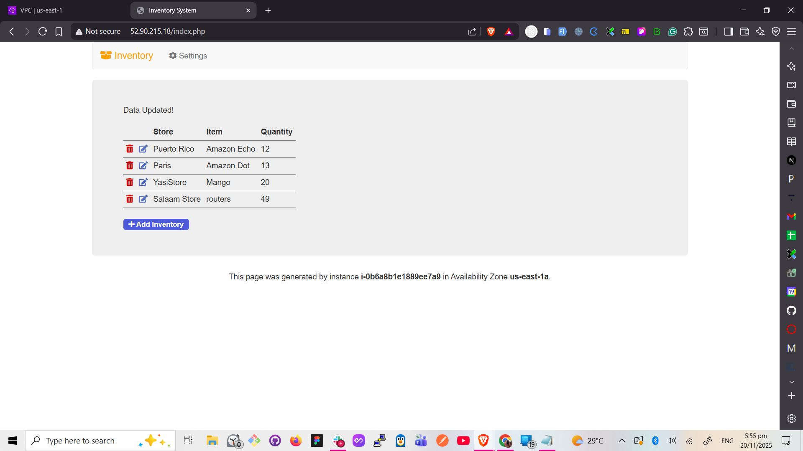

# VPC Peering Configuration - Lab Documentation

## Date: November 20, 2025

## Overview

Successfully configured VPC peering connection between two VPCs to enable private communication between an Inventory application and a database.

## Pre-Lab Verification

Before starting the actual tasks, I performed initial exploration:

- **Verified EC2 instance** - Checked the Inventory application running on EC2 in Lab VPC's public subnet
- **Verified database instance** - Confirmed database running in Shared VPC's private subnet
- **Tested connectivity** - Attempted to access the application via IPv4 public address to connect to the db (not working as expected - this was the problem to solve)

## Tasks Completed

### Task 1: Created VPC Peering Connection

- Created peering connection named `Lab-Peer`
- Configured requester VPC: Lab VPC (10.0.0.0/16)
- Configured accepter VPC: Shared VPC (10.5.0.0/16)
- Accepted the peering connection request

NB: I accepted the request because it was within the same account

### Task 2: Configured Route Tables

**Lab Public Route Table (Lab VPC):**

- Added route: 10.5.0.0/16 → Lab-Peer peering connection
- Enables traffic from Lab VPC to Shared VPC

**Shared-VPC Route Table:**

- Added route: 10.0.0.0/16 → Lab-Peer peering connection
- Enables return traffic from Shared VPC to Lab VPC

**Troubleshooting Issue:**

- Initially configured the peering route in the **private route table** by mistake
- Tested the app - it didn't work
- Paused and reviewed the configuration
- Identified the route was in the wrong subnet
- **Solution:** Deleted route from private route table and reconfigured it in the public route table
- Tested App again and its working correctly

### Task 3: Tested VPC Peering

- Configured Inventory application with database endpoint
- Successfully connected application to database through peering connection
- Confirmed data retrieval from database by deleting, adding, editing an item in the inventory

## Result

✅ VPC peering connection successfully established and tested. Application now communicates with database across VPCs without requiring internet gateway.

📸 _Screenshot: Volume created_

## Key Learnings

- VPC peering enables private routing between VPCs
- Route tables must be configured in both directions
- **Routes must be in the correct subnet's route table** (public vs private matters!)
- Peering works without internet gateway (private connectivity)
- Connection must be explicitly accepted by target VPC

## Experiments & Breaking Things to Learn

After completing the lab successfully, I intentionally broke things to understand dependencies:

**Experiment: Deleting Internet Gateway Route**

- Deleted the internet gateway route from the public route table
- **Result:** App stopped rendering (as expected)
- Reconfigured the internet gateway route
- **Result:** App worked again

**Lesson:** Even though VPC peering handles app-to-database communication, the internet gateway is still needed for users to access the web application from the internet.
