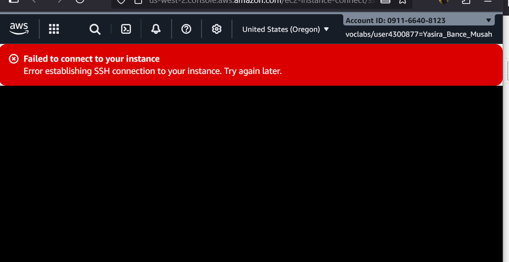

# Troubleshooting a VPC

**Week:** 7
**Module:** Networking & Security
**Duration:** 75 minutes

---

## 🎯 Objectives

At the end of this task, I:

- Create VPC Flow Logs and publish them to S3 bucket.
- Troubleshoot VPC configuration issues such as route table, security group, NACL.
- Analyze VPC Flow Logs for rejected and accepted traffic.

---

## 🛠️ Steps Taken

### 1. Setup & Connection

- Launched lab environment for 2 VPCs, that is EC2 Café Web Server, CLI Host.
- Connected to the CLI Host Instance via **EC2 Instance Connect**.
- Configured AWS CLI profile with provided credentials. such as the access key, secret key, default region and the default output in json

### 2. Created VPC Flow Logs

- Created S3 bucket `flowlog257835` for flow logs:
  flowlog257835 is the bucket name

  ```bash
  aws s3api create-bucket --bucket flowlog257835 --region 'us-west-2' --create-bucket-configuration LocationConstraint='us-west-2'
  ```

- Returned an object output containing the location of where the bucket has been created

- Retrieved the VPC ID for VPC1:

  ```bash
    aws ec2 describe-vpcs --query 'Vpcs[*].[VpcId,Tags[?Key==`Name`].Value,CidrBlock]' --filters "Name=tag:Name,Values='VPC1'"
  ```

- Returned an array output

  ```bash
  [
    [
        "vpc-0045c5e4b67408da7",
        [
            "VPC1"
        ],
        "10.0.0.0/16"
    ]
  ]
  ```

- Created the VPC Flow Logs on VPC1:

  ```bash
  aws ec2 create-flow-logs \
    --resource-type VPC \
    --resource-ids vpc-0045c5e4b67408da7 \
    --traffic-type ALL \
    --log-destination-type s3 \
    --log-destination arn:aws:s3:::flowlog257835
  ```

- Returned output

  ```bash
  {
      "Unsuccessful": [],
      "FlowLogIds": [
          "fl-0ddc55f86194f1c9b"
      ],
      "ClientToken": "oGLhRi9CQi5klEr2bEg5F8CtKU3UlUJ0v8SBpRgQSI8="
  }
  ```

- Confirmed Flow Log creation:

  ```bash
    aws ec2 describe-flow-logs
  ```

### 3. Troubleshooting Issues

#### Issue #1: Web page not loading

- Found details about web server instance which is the cafe server public ip address in a vpc1:

  ```bash
    aws ec2 describe-instances --filter "Name=ip-address,Values='52.88.10.200'"
  ```

- Filtered the results only to return
- the state of the instance,
- the private IP address,
- the instance ID,
- the security groups that are applied to it,
- the subnet in which it runs, and
- the key pair name that is associated with it

  ```bash
    aws ec2 describe-instances --filter "Name=ip-address,Values='52.88.10.200'" --query 'Reservations[*].Instances[*].[State,PrivateIpAddress,InstanceId,SecurityGroups,SubnetId,KeyName]'
  ```

NB: To return only relevant details, I filtered the results on the client side by using the query parameter

- Cafe web server instance is running but the webpage is not loading
- Conducted investigation by using only AWS CLI programmatic access
- install the nmap → sudo yum i -y nmap → nmap 52.88.10.200 or nmap -Pn 52.88.10.200
  This skips ping and goes straight to scanning open ports.

- First Used `nmap` utility to check for open port → no ports open.


- Second Checked security group rules or details with it id → **HTTP (80) not allowed**.

  ```bash
    aws ec2 describe-security-groups --group-ids 'sg-05bba497b52fa9035'
  ```

- Thirdly Checked the route table settings for the route table that is associated with the subnet where the cafe web server is running

  - VPC1PubSubnetID subnet-0b9b846de14fe48f1
  - route-table-ids rtb-07986fdaac001a165
  - VPC1GatewayId igw-05a75fc31a83fe4f5

  ```bash
    aws ec2 describe-route-tables  --route-table-ids 'rtb-07986fdaac001a165' --filter "Name=association.subnet-id,Values='subnet-0b9b846de14fe48f1'"
  ```

  
  

- Created a new route and configured the internet gateway

```bash
  aws ec2 create-route --route-table-id 'rtb-07986fdaac001a165' --gateway-id  'igw-05a75fc31a83fe4f5' --destination-cidr-block '0.0.0.0/0'
```

- Webpage loaded successfully (`Hello From Your Web Server!`).
  .png>)

Root cause:

- Port were already opened
- Security Group ✅ allowed SSH.

- Instance ✅ was running.

- Route Table ❌ had only the local route, no internet route.

- Fix ✅ added 0.0.0.0/0 → igw-05a75fc31a83fe4f5.

#### Issue #2: SSH access failing

- Cafe web server instance is running
- Security group allowed port 22, route table was correct.
- Checked **Network ACL** associated with subnet where it running:



```bash
aws ec2 describe-network-acls --filter "Name=association.subnet-id,Values='subnet-0b9b846de14fe48f1'"
```

- Found explicit **DENY rule** for inbound SSH for rule number 40.
- Deleted the rule:
  network acl id acl-02ccb6219c9416294

  ```bash
    aws ec2 delete-network-acl-entry --network-acl-id acl-02ccb6219c9416294 --rule-number 40 --ingress
  ```

- Successfully connected via EC2 Instance Connect and verified hostname.

### 4. Flow Logs Analysis

- Downloaded logs from S3:

  ```bash
  aws s3 cp s3://flowlog257835/ . --recursive
  ```

- Cd into the required directory

  ```bash
    cd <AWSLogs/AccountID/vpcflowlogs/us-west-2/yyyy/mm/dd/>
  ```

- Files are compressed
- Extracted logs gunzip \*.gz

- Viewed files >> head filename

- Extracted `.gz` files and searched for rejections:

  ```bash
  grep -rn REJECT .
  ```

- Found out number of records that were returned

  ```bash
    grep -rn REJECT . | wc -l
  ```

- Refined search by looking for only lines that contain 22 which is the port number attempted to connect to the web server when access was blocked return a smaller number of results

  ```bash
    grep -rn 22 . | grep REJECT
  ```

- Filtered failed SSH attempts:

  ```bash
  grep -rn 22 . | grep REJECT | grep 41.204.44.226
  ```

- Confirmed logs matched the troubleshooting steps.

```bash
aws ec2 describe-network-interfaces --filters "Name=association.public-ip,Values='52.88.10.200'" --query 'NetworkInterfaces[*].[NetworkInterfaceId,Association.PublicIp]'
```

---

## 🔑 Key Learnings

- Security groups and NACLs must both be configured properly for connectivity.
- VPC Flow Logs are invaluable for identifying blocked traffic.
- CLI - first troubleshooting builds deeper AWS networking confidence.

---

## 🚧 Challenges

- Bucket naming conflicts → solved by appending random digits.
- Analyzing JSON output required precise query filters with `--query`.

---

## ✅ Lab Completed

Successfully created VPC Flow Logs, troubleshot connectivity issues, and analyzed flow logs.
Issue: Couldn’t SSH into EC2 even after fixing route table.

Root Cause: NACL rule 40 denied inbound TCP port 22.

Resolution: Deleted NACL to allow port 22 from your IP or 0.0.0.0/0.

Lesson Learned: Always check both SG and NACL. SGs are stateful remember return traffic, NACLs are stateless (need both inbound + outbound rules).
